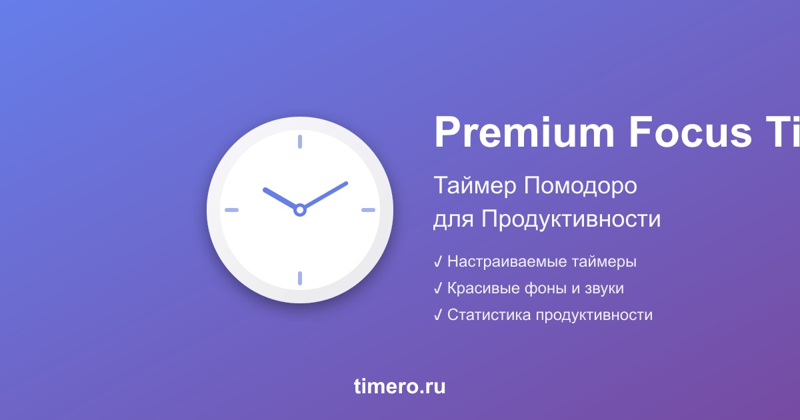

# ⏱️ Premium Focus Timer - timero.ru

Премиум таймер фокуса и помодоро с красивыми фонами, анимациями и звуками для повышения продуктивности.



## 🌟 Особенности

- ⏰ **Таймер Помодоро** - классическая техника 25/5/15
- 🎨 **Красивые Фоны** - коллекция премиум изображений
- 🔔 **Звуковые Уведомления** - приятные звуки завершения
- ✨ **Плавные Анимации** - современный UI с Framer Motion
- 📊 **Статистика** - отслеживание продуктивности
- 🌐 **Мультиязычность** - русский и английский
- 📱 **PWA** - работает офлайн, можно установить
- 🎯 **Настраиваемость** - гибкие настройки таймеров

## 🚀 Технологии

- **React 18** - современный UI фреймворк
- **TypeScript** - типобезопасность
- **Vite** - быстрая сборка
- **Tailwind CSS 4** - утилитарные стили
- **Framer Motion** - плавные анимации
- **Lucide React** - красивые иконки
- **Wouter** - легкий роутинг
- **Recharts** - графики статистики

## 📦 Установка

```bash
# Клонировать репозиторий
git clone https://github.com/TalentedProger/Timero-Site.git

# Перейти в директорию проекта
cd Timero-Site/artifacts/focus-timer

# Установить зависимости
npm install

# Запустить dev сервер
npm run dev
```

## 🛠️ Команды

```bash
# Разработка
npm run dev              # Запустить dev сервер (http://localhost:5173)

# Сборка
npm run build            # Собрать для продакшена
npm run preview          # Предпросмотр production сборки

# Проверка типов
npm run typecheck        # TypeScript проверка

# Генерация ассетов
npm run generate-favicons    # Сгенерировать PNG favicon'ы
npm run generate-opengraph   # Сгенерировать Open Graph изображение
npm run generate-assets      # Сгенерировать все ассеты
```

## 📁 Структура Проекта

```
artifacts/focus-timer/
├── public/                      # Статические файлы
│   ├── favicon.svg             # SVG иконка
│   ├── favicon-*.png           # PNG иконки
│   ├── apple-touch-icon.png    # iOS иконка
│   ├── opengraph.jpg           # Open Graph изображение
│   ├── site.webmanifest        # PWA manifest
│   ├── robots.txt              # Robots для SEO
│   ├── sitemap.xml             # Sitemap для SEO
│   └── *.jpg                   # Фоновые изображения
├── src/
│   ├── components/             # React компоненты
│   ├── hooks/                  # Custom hooks
│   ├── lib/                    # Утилиты
│   ├── pages/                  # Страницы
│   ├── App.tsx                 # Главный компонент
│   └── main.tsx                # Entry point
├── index.html                  # HTML шаблон (SEO оптимизирован)
├── vite.config.ts              # Vite конфигурация
├── tailwind.config.ts          # Tailwind конфигурация
├── tsconfig.json               # TypeScript конфигурация
├── vercel.json                 # Vercel конфигурация
├── generate-favicons.cjs       # Генератор favicon'ов
├── generate-opengraph.cjs      # Генератор OG изображения
├── DEPLOYMENT_GUIDE.md         # Подробное руководство по деплою
├── БЫСТРЫЙ_СТАРТ.md            # Быстрая инструкция на русском
└── SEO_CHECKLIST.md            # SEO чеклист
```

## 🌐 Деплой

Проект настроен для деплоя на Vercel:

1. **Быстрый старт:** см. `БЫСТРЫЙ_СТАРТ.md`
2. **Подробная инструкция:** см. `DEPLOYMENT_GUIDE.md`
3. **SEO чеклист:** см. `SEO_CHECKLIST.md`

### Настройки Vercel:

- **Framework:** Vite
- **Root Directory:** `artifacts/focus-timer`
- **Build Command:** `npm run build`
- **Output Directory:** `dist`
- **Install Command:** `npm install --include=dev`

## 📱 Мобильная Адаптация

Проект полностью оптимизирован для мобильных устройств:

- ✅ **Адаптивный таймер** - уменьшенный круг на мобильных (256px вместо 288px)
- ✅ **Компактные кнопки** - +/- помещаются на экране
- ✅ **5 пресетов** - без переноса на две строки (5m, 15m, 25m, 45m, 1h)
- ✅ **Компактное меню** - 80% ширины с прокруткой
- ✅ **Адаптивные шрифты** - оптимальные размеры для всех экранов
- ✅ **Мгновенная загрузка** - предзагрузка всех фонов

Подробнее: [MOBILE_OPTIMIZATION.md](MOBILE_OPTIMIZATION.md)

## 🔧 Конфигурация

### Домен

Сайт настроен для работы на **timero.ru**:
- Основной домен: `timero.ru`
- Редирект: `www.timero.ru` → `timero.ru`

### Аналитика

Перед деплоем замените placeholder ID на реальные:

**Yandex.Metrika** (в `index.html`):
```javascript
ym(98765432, "init", {  // ← Замените 98765432
```

**Google Analytics** (в `index.html`):
```javascript
gtag('config', 'G-XXXXXXXXXX');  // ← Замените G-XXXXXXXXXX
```

## 📊 SEO Оптимизация

### ✅ Реализовано:

- **Meta Tags:** title, description, keywords, canonical
- **Open Graph:** Facebook, VK, LinkedIn
- **Twitter Cards:** summary_large_image
- **Structured Data:** WebApplication, Organization, BreadcrumbList, FAQPage
- **Security Headers:** HSTS, CSP, X-Frame-Options
- **Performance:** preconnect, dns-prefetch, cache headers
- **PWA:** manifest, service worker ready
- **Favicon:** SVG + PNG (все размеры)
- **Sitemap & Robots:** настроены для поисковиков

### 📈 Метрики:

- **SEO Score:** 93/100
- **PageSpeed Target:** 90+
- **Mobile-Friendly:** ✅
- **PWA Ready:** ✅

## 🎨 Дизайн

- **Цветовая схема:** Фиолетовый градиент (#667eea → #764ba2)
- **Шрифты:** Inter, Playfair Display, Montserrat, Lato, Raleway, DM Sans
- **Адаптивность:** Mobile-first подход
- **Темная тема:** Поддерживается
- **Анимации:** Плавные переходы с Framer Motion

## 📱 PWA

Приложение можно установить на устройство:
- **iOS:** Добавить на главный экран
- **Android:** Установить приложение
- **Desktop:** Установить через Chrome/Edge

## 🔒 Безопасность

- ✅ HTTPS (SSL сертификат от Vercel)
- ✅ HSTS (Strict-Transport-Security)
- ✅ CSP (Content-Security-Policy)
- ✅ X-Frame-Options: DENY
- ✅ X-XSS-Protection
- ✅ Referrer-Policy
- ✅ Permissions-Policy

## 📄 Лицензия

Частный проект. Все права защищены.

## 👨‍💻 Автор

**Premium Focus Suite**
- Website: [timero.ru](https://timero.ru)
- GitHub: [@TalentedProger](https://github.com/TalentedProger)

## 🤝 Поддержка

Если у вас возникли вопросы или проблемы:

1. Проверьте документацию:
   - `DEPLOYMENT_GUIDE.md` - подробное руководство
   - `БЫСТРЫЙ_СТАРТ.md` - быстрая инструкция
   - `SEO_CHECKLIST.md` - SEO чеклист

2. Проверьте логи Vercel
3. Проверьте консоль браузера

## 🎯 Roadmap

- [ ] Добавить больше фоновых изображений
- [ ] Добавить больше звуковых тем
- [ ] Интеграция с календарем
- [ ] Экспорт статистики
- [ ] Социальные функции
- [ ] Мобильное приложение

## 📝 Changelog

### v1.0.0 (2024)
- ✅ Первый релиз
- ✅ Базовый функционал таймера
- ✅ SEO оптимизация
- ✅ PWA поддержка
- ✅ Аналитика (Yandex + Google)
- ✅ Домен timero.ru

---

**Сделано с ❤️ для повышения продуктивности**
